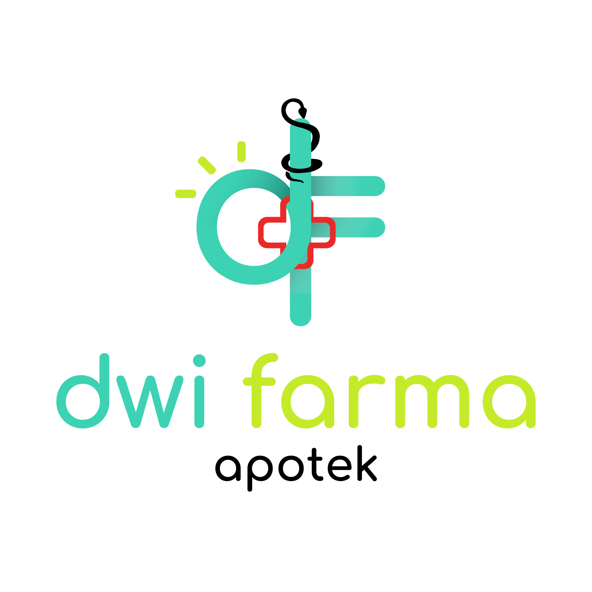

**Sistem manajemen apotek modern — cepat, rapi, dan mudah digunakan.**

---

## 👋 Tentang Kami

Apotek Dwi Farma adalah aplikasi manajemen apotek yang dibangun untuk membantu operasional harian apotek — mulai dari pencatatan resep, pengelolaan stok obat, hingga transaksi penjualan — jadi lebih cepat dan terorganisir.

Dibangun dengan stack modern:

- ⚙️ **Backend:** Laravel
- ⚛️ **Frontend:** Inertia.js + React
- 🎨 **Styling:** Tailwind CSS + shadcn/ui

## 🚀 Proyek Utama

| Repository | Deskripsi |
|---|---|
| [`apotek-dwi-farma`](https://github.com/ORG_NAME/apotek-dwi-farma) | Aplikasi utama manajemen apotek (Laravel + Inertia + React) |

## 👥 Tim

| Nama | Peran |
|---|---|
| **Muhammad Zaqly Luluang** | Frontend Developer |
| **Ichang** | Backend Developer |

## 📫 Kontak

Punya pertanyaan atau ingin kolaborasi? Hubungi kami melalui [dwifarma.com](https://dwifarma.com).
